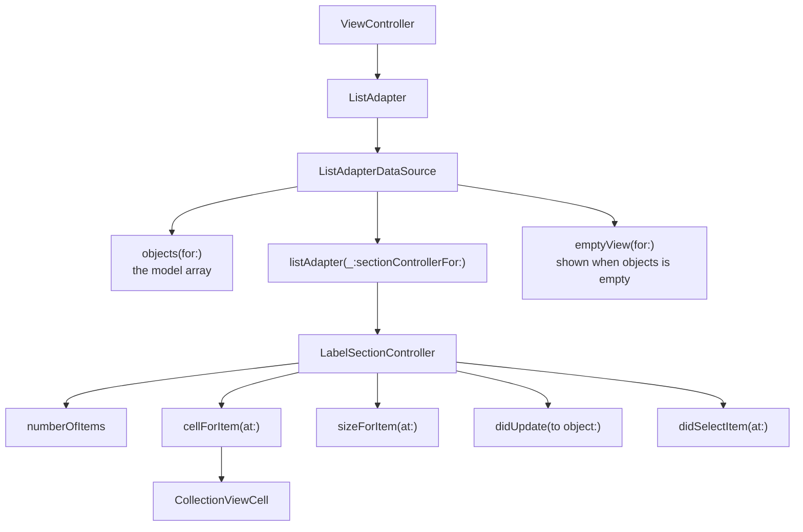

# IGListKit

*Instagram's collection view framework, set up with section controllers and an empty state.*

    

## Overview

IGListKit replaces the data source with an adapter that asks for objects and returns a section controller for each. Updates are computed by diffing rather than applied by index, which is the same idea Apple later shipped as diffable data sources.

## How it works



## Implementation notes

- **One section controller per object.** Each model owns its own sizing, cell and selection behaviour, so a mixed feed is a list of controllers rather than a switch statement.
- **Diffing requires ListDiffable.** Objects supply a diff identifier and an equality check, which is how the adapter decides what moved and what changed.
- **Empty state built in.** `emptyView(for:)` is part of the data source, so the empty case is not an extra overlay managed by the controller.
- **prepareForReuse implemented.** The cell clears its label, since the adapter recycles cells the same way UIKit does.

## Project structure

```
IGListKitt/
├── ViewController.swift       adapter and data source
├── SectionController.swift    LabelSectionController
└── CollectionViewCell.swift
```

## Requirements

Xcode 15 or later, iOS 17.5 or later, Swift Package Manager for IGListKit.
